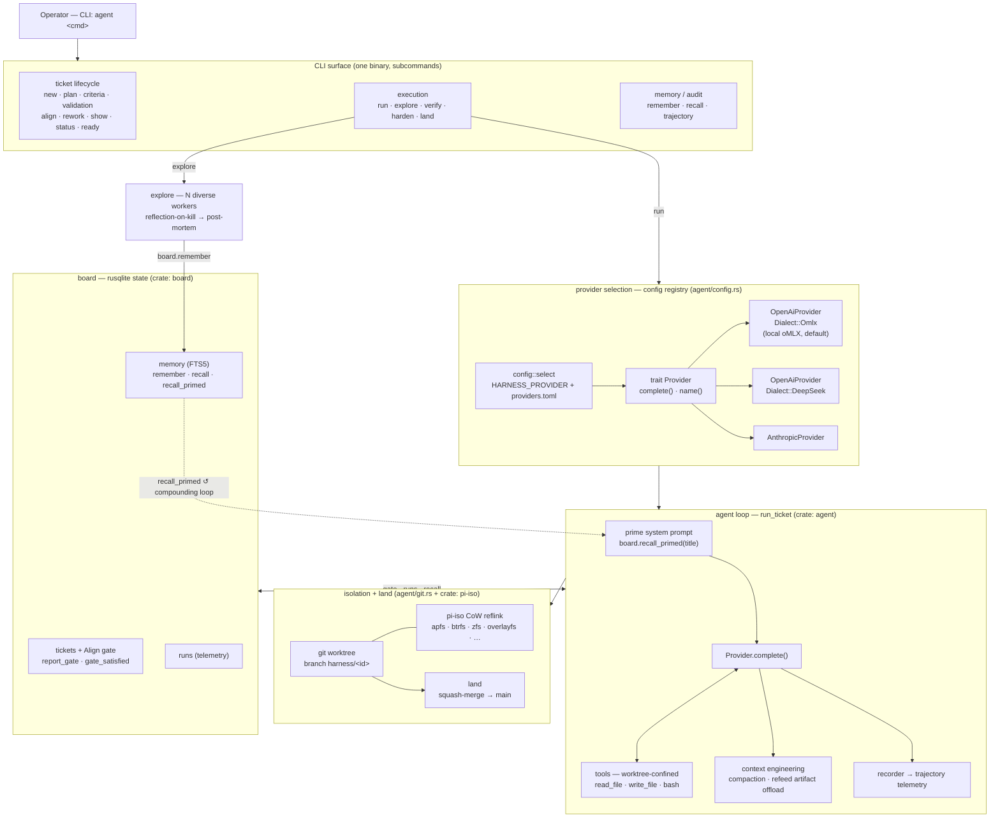

# Architecture — Personal Dev Harness

> Summary layer. Full detail: `research/00-design-v2.md`. Pillars grounded in `research/01..08`.

## What it is

A personal AI-engineering dev harness, replacing the pure-instruction `dev` skill. Goal: process enforced
by **code** (not advisory prose), context kept coherent via a **git-shaped branch/promote** model, memory
that compounds at ~zero marginal cost on **local models**, and a harness that **evolves itself** under a
constitution. Forever-personal, local-first, hardware-specific, eventually self-building.

## System map — the code shape (start here when lost)

> The sections below (planes / spine / pillars) are the *concepts*. This is the *code*: four crates, one
> binary, and the path a ticket takes from align → run → land. Update it when a crate, seam, or the core
> flow changes. Renders on GitHub and any mermaid viewer.



### The four crates

| crate | role | key files |
|-------|------|-----------|
| **provider** | normalized LLM seam — one `Request`/`Response`, one `trait Provider`, N wire formats | `lib.rs` (trait + model), `openai.rs` (oMLX + DeepSeek dialects), `anthropic.rs` |
| **agent** | the binary: CLI + agent loop + orchestration | `main.rs` (loop, `run_ticket`, CLI), `config.rs` (provider registry), `gate.rs` (Align), `git.rs` (worktree/land), `tools.rs`, `planexec.rs`/`loopgate.rs` (plan→execute), `refeed.rs` (artifact offload), `recorder.rs` (trajectory), `explore.rs`, `evolve.rs` |
| **board** | rusqlite state of record | `board.rs` (tickets/gates/runs), `memory.rs` (FTS5 recall), `workpad.rs`, `spine.rs`, `schema.rs`, `model.rs` |
| **pi-iso** | filesystem worktree isolation via CoW reflink, per-OS | `apfs.rs`, `btrfs.rs`, `zfs.rs`, `overlayfs.rs`, `linux_reflink.rs`, `windows_block_clone.rs`, `projfs.rs`, `rcopy.rs` (fallback) |

### The path a ticket takes

1. **Align** (`agent align <id>`) — clears the keystone gate; the ticket can't be mutated until plan +
   criteria pass (`gate::mutating_allowed`). "Align before execute," enforced by code.
2. **Run, isolated** (`agent run <id>`) — `config::select` picks `(Provider, model)`; a git worktree on
   `harness/<id>` (CoW via `pi-iso`) isolates churn; `run_ticket` primes from `recall_primed`, then loops
   `Provider.complete()` ⇄ worktree-confined tools, with compaction + artifact offload + trajectory
   recording; work commits to the branch as WIP.
3. **Land** (`agent land <id>`) — squash-merges to `main`. `verify`/`harden`/`rework` are the detours.

**The compounding loop:** `explore` fans out N diverse workers that *never land* — on kill each reflects
and writes a post-mortem (`board.remember`). The next related `run` pulls them back via `recall_primed`,
priming future workers at ~zero cost on the local model. That dashed arrow is the flywheel.

## Three planes

- **Work** — a durable BOARD of tickets; each has a WORKPAD (Plan / Acceptance / Validation / Notes /
  Confusions) and moves through an explicit STATE MACHINE whose transitions are un-skippable gates;
  promotion to mainline = a LAND gate gated on proof-of-work.
- **Execution** — a COORDINATOR dispatching WORKERS in **git-worktree-isolated** workspaces; churn lives/dies
  in the worktree, only the squashed result + workpad promote. Model-per-role.
- **Memory** — curated **wiki** prose (semantic+procedural, never decays) + a decaying embedded **sidecar**
  (episodic), embeddings on local **oMLX** (~zero cost). Top-k retrieval, never whole-store injection.

## The work spine

```
Todo → Align → In Progress → Verify → Review → Land → Done    (+ Rework: hard reset → re-enter Align)
```
- **Align (P1)** — the keystone gate: block all execution tools until the plan + criteria are confirmed.
  Validated at runtime in the spike (`research/07`).
- **Verify** — mechanical checklist + the **Harden gate**: test quality is a *number* (mutation score),
  not a vibe. Author and mutator on different providers.
- **Land** — squash-merge; main only ever sees distilled output.

## Five pillars (+ P0)

P0 auto-context priming · P1 Align gate · P2 branch/promote isolation · P3 memory · P4 parallel exploration
with pruning · P5 reflection/self-evolution under a **constitution (immutable) / case-law (agent-editable)** split.

## Cross-cutting principles

1. **Gate by a number or an artifact, never a vibe.**
2. **The Align criteria are the keystone** — they are the Verify oracle, the P4 pruning function, *and* the
   grounding for reflection.
3. **One pipeline reused three times:** raw→distilled→promoted-with-verification = memory (episodic→wiki) =
   context (churn→main) = evolution (case-law→constitution).

## Runtime / base — RESOLVED → Strategy A (Rust-native)

Settled in `research/11-foundation-decision.md` (see `decisions.md`): **full Rust**, local-first, owned
forever. The TS-on-Pi spike (`harness-spike/`) validated the Align-gate mechanic and was then re-platformed
into the four Rust crates above. External refs (`oh-my-pi`, `pi-mono`, `symphony`, `beads`) are mined for
*designs*, not runtime deps. The provisional TS adoption layer (old design-v2 §2/§10) is retired.
